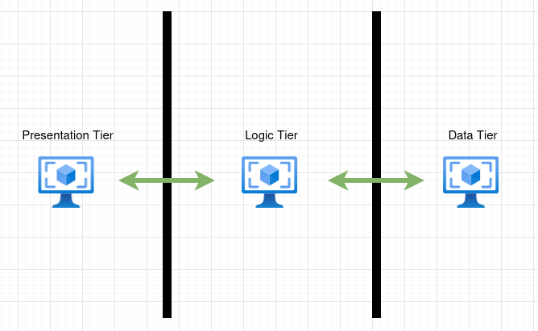

# Obligatory Assignment 2 – Architecture Patterns and Version Control

1. What is a ’Layered’ Architecture – what is the difference between an open and a
   closed layer? – provide an example of why closed layers may cause a problem

   A layered architecture consists of any amount of layers.

   Layers can only comunicate downwards. A simple example of a layered architecture could be something like this:

   

   The intension of doing this layering is to split an application into multiple seperations of conserns, such that you if done well end up with highly cohesive code.

   An example of splitting up an application into seperate layers, could be your traditional `presentation layer -> business layer -> persistence layer -> database layer` but there are no rules about how many layers there should be or even what they are.

   The difference between an open and a closed layer is the amount of layers a specific layer can access. While a closed layer can only access the next layer below itself, an open layer can access all layers below it.

   While making use of a closed layer you may find yourself wanting to use functionality in a layer which is past the next immediate layer. This might be a short term inconvenience to you, because now if you want to stay with a closed layer you will have to go through each layer until you hit the layer in question.
   I called this a short term problem because by doing this, you are making sure you only have a single layer as you dependency.

2. Testability is often given as an advantage of layered architectures. How does a
   layered architecture make testing easier and more structured? Provide an example
   of how testing can be supported by using a layered architectural approach – this is a
   good place to use a code example (hint – loose coupling compared to monolithic)

   A layered architecture makes testing easier because of the physical boundaries set in place using layers.
   Where testing becomes extreamly easy is if you follow a closed layer approach.
   This makes sure that you reduce the amount of dependencies a specific layer has which in tern limits the amount of things that may have to be mocked or otherwise setup when testing.

   An example of how testing can be done using layered architecture could be something like this:

   Lets say that we have an application layer which handles requests from clients. The application layer then figures our which actions that has to be taken according to the requested resource.

   In our example we make use of an open layer, which means it has access to all layers beneath it.

   The Controller:

   

   This controller, is an open layer because it has access to both our domain layer (ExampleService) and our infrastructure layer. (ExampleRepository)
   There are many different tests we can perform on this layer, but lets look at how integration testing this together with our ExampleService implementation would look like.

   

   Because the ExampleController makes use of dependency injection, we can provide it with whatever implementation of the required interfaces our controller takes as arguments.
   This means that we are able to mock the repository we use to comunicate with our database, so that the test doesn't need to consider that a factor in the test.

   However, because our application layer depends on both the domain layer and the integration layer, we have opened ourselves to possible human mistakes.
   Instead of providing the mocked implementation of our repository to the controller, we have provided it with the actual implementation that talks with the database.
   This is maybe quite a silly example but these things can easily happen, especially ones you start working with more complicated applications, and use stuff like dependency injection frameworks.

3. One disadvantage of layered architecture is often given as the risk of ‘leaking logic’
   between the layers. What does this mean in practice and why might it be a problem?
   – hint what is the point of layers and how do we draw the boundary?

   The topic of leaking logic between layers broadly means to let other layers know about specific implementations inside your layer. To avoid this leaking we make make use of contracts, which in java land would be an interface.
   The interface must not expose specific knowledge about underlieing objects of the layer in question, so that the calling layer doesn't need to depend on them.
   All in all this makes sure that the calling layer doesn't depend on concretes, which makes for loose coupling between layers

   Although this is definitely a thing in a layered architecture, these problems also arise when using other architectures such as hexagonal architecture or domain driven design.

4. Layers are Logical and Tiers are physical –. A widely used version of N-tier involves
   three tiers – what are they and what is the role of each of them? This could be
   illustrated with an example application and diagrams.

   The term N-tier architecture is used to physically seperate functionality of the tiers by placing them into seperate machines such as VMs or clusters.

   By seperating tiers into different machines, we ensure that each of these tiers are at their top capacity, and that each tier is completely independent of the other tiers.
   This means that you are compleatly free to scale a specific tier either up or down depending on the amount of trafic they can handle.

   A typical N-tier architecture could be something like this:

   

   - Presentation tier

     The presentation tier is the user interface or user interfaces. It is responsible for comuncating with a client which in most cases is an actual person.

   - Logic tier

     The logic tier is where services that handle requests from the presentation tier lives. This could be simple commands such as getting all food orders.

   - Data tier

     The data tier is where we store and retrieve data, this could be through things such as file systems or databe through things such as file systems or databases.

5. Event Driven Architecture has been described as “a distributed, asynchronous
   software architecture pattern that integrates applications and components through
   the production and handling of events”. How would you explain this description to a
   business user? You might find it helpful to illustrate the answer with diagrams.

   The typical way an application would complete some sort of task, would be through calling a bunch of predefined logic, wether this is inside a single huge application, or in multiple applications working together, the overall idea would'nt change.
   So you end up with a bunch of logic that is completely coupled together with specific applications / functionality inside the same application.

   What event driven architecture tries to do, is solve the tight coupling between these applications.
   It does this by changing the way applications comunicate together - now instead of an application having to know exactly what to do after a specific thing has happened in the system, it tells the whole world that that this has happened, and then other applications are able to act on these specific things.

   Let's look at an example flow using first the old way of comunication and then how event driven architecture changes how this comunication happens.

   **The flow:**

   1. A person wants to setup insurrance for their newly bought car.
   2. A request is made to our insurrance application, about setting this up. This contacts SKAT and it does some internal things which in the end accepts the request.
   3. Ones the car is correctly insurred, the insurrance application contacts our, internal applications which need to know about the car registration.
      There may be many reasons for the applications to know about this, such as being able to cache this for later requests, saving it to a database or even using it for analytics.
   4. Ones all applications have been notified it, we simple tell the person that their insurrance registration was successfull.

   Using a traditional approach:

   

   Using an event driven approach:

   

   So now instead of having the insurrance application know about every single application that needs to know about that specific thing that happened, it just needs to tell the event handler that it happened and then the event handler will send it to all applications which care about it.

   This also enables us to easily add new applications which care about that event, as shown in the event driven approach. As you can see there has beed added a third system which also listens for the same event - and no logic had to be changed.

6. What is the difference between a message queue (point to point pattern) and
   message topics (publish-subscribe pattern)? Provide diagrams to illustrate your
   explanation.

   Simply put a message queue means that ones a message is dequeue'ed (or read) by a service listening to a queue, it is gone. No other service listening to that same queue will be able to consume it.

   

   This is useful for situations where you want to make sure that a message is only read ones.
   Maybe in the situation of the previous example the two subscribers are the same applications one of which is a replica of the other, so you wouldnt want the same operation to be done on both of them.

   A message topic does this differently by providing the message emitted to the topic, to all services listening to that topic.
   The messages are then stored in that topic for X amount of time, and each service has their own 'log' which knows if a service has already recieved a specific message.
   This means that we are able to add a new subscriber, and it would still be able to read all previous messages from that topic. This is also known as event sourcing.

   

7. Follow the kafka introduction https://kafka.apache.org/intro and provide an
   example of how kafka can be used to support an event stream. (the quick start tutorial will help https://kafka.apache.org/quickstart )
8. A mediator topology and a broker topology can both be used to manage event
   streams. Briefly describe what broker and mediator topologies are and the use cases
   they are best suited to. Use diagrams to illustrate your answer, which could relate to
   the same application but different services (ones better suited to a mediator
   topology and one to a broker technology)
   Version Control
9. Set up a git repository according to the rules of the Github Flow and Trunk based
   development strategies and explain the arguments for and against using them. As
   part of your answer explain why the Git Flow strategy is now considered out of date.
   Use tools like git log --graph demonstrate how files are stored in git using the
   different strategies.
   you may want to watch the LinkedIn Learning course Git Workflows.
10. Explain what git blobs, trees, commits and tags are as git object types. Provide a
    brief explanation of their role in the git system. This answer should include screen
    shots of a git repository file system being explored showing the different object
    types.
11. Explain what the following two commands mean: Provide examples of exploring the
    git objects stored in your local file system.

```bash
find .git/objects
git cat-file -p 3d8071 # (where 3d8071 is a partial SHA1 hash)
```

12. What does the git cherry-pick command do? Provide an example of using it
    and explain how it is useful.
